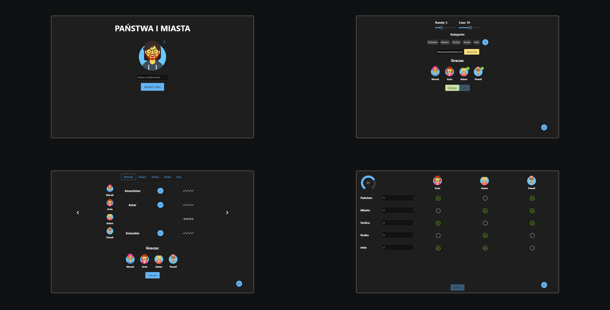

# Panstwa i miasta
This is a game "Country and city" which allows you to play with your friends.

You can create the room and invite your friends. In the lobby you can change settings such as time and number of rounds. You can also select categories or add your own. As you type the words you will see how your friends are doing. When the time is up, a view will appear in which you can vote for individual words

## Preview

http://panstwamiasta.online/

## Tech Stack

- Vuejs
- Nodejs
- socket.io
- mongoDB
- primevue

## Author

Krzysztof Wasiński - [GitHub](https://github.com/wasinapl)
